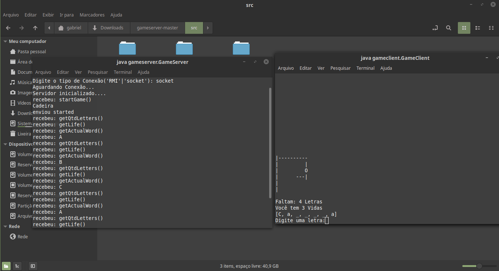

# Jogo da forca com Sockets e RMI
Jogo da forca para a disciplina Sistemas Distribuidos do curso de Ciência da Computação da UNICAP. 

## Para rodar nescessário dar build nos projetos dentro das respectivas pastas:
1 - Build no Server

        $ javac gameserver/GameServer.java

2 - Build no Client

        $ javac gameclient/GameClient.java

## Após o build somente executar:
1 - Executar primeiro o Server

        $ java gameserver.GameServer

- escolher o tipo de conexão

2 - Executar o client

        $ java gameclient.GameClient 
        
- escolher o mesmo tipo de conexão do server 

